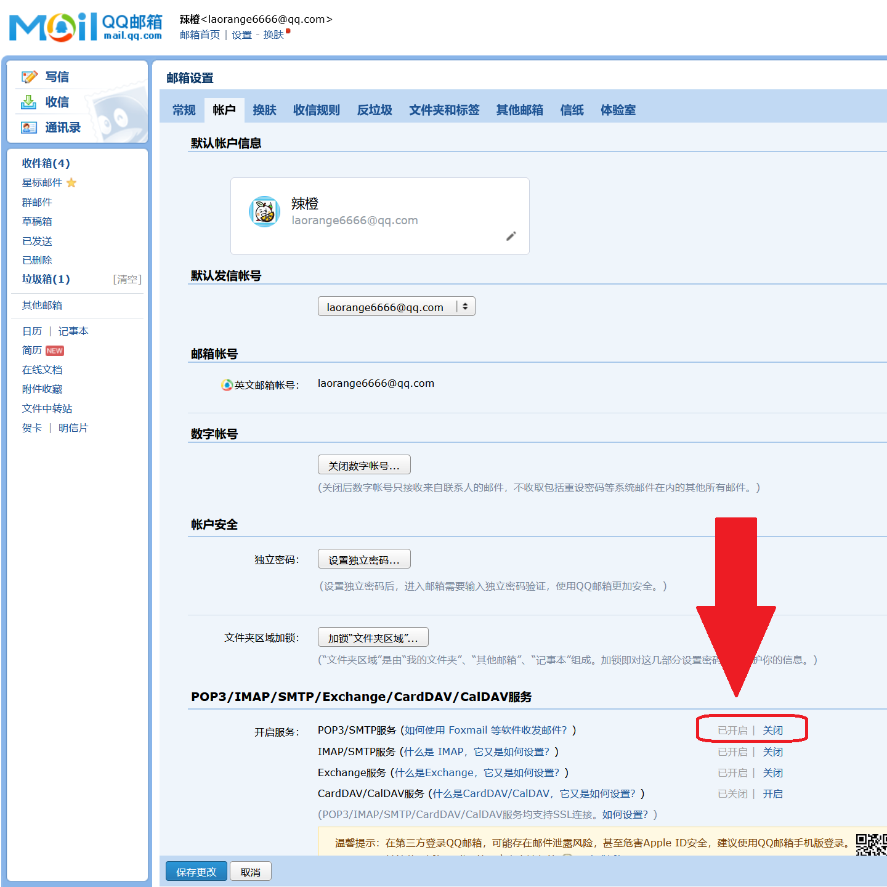

# 基于邮件的文件收集程序

requirements: [zmail](https://github.com/zhangyunhao116/zmail)

```python
pip install zmail
```


## 实现过程

双击exe即可使用。每隔若干时间查看一次邮箱，批量下载过去1小时内的未读邮件的附件。

1小时是设定的区间大小，所以检查周期被设定为3000秒以内（需要改的话可以在源码里改）。

因为想要用单个文件实现，又需要用``pyinstaller`封装，所以避开了一些可能封装不了的方法，最终采用的是`zmail`来发送邮件，使用`sqlite3`来记录信息。


## 请注意

+ 同名文件会被覆盖，所以可以利用这一特性，让重复发送的文件取更新的。但也正如此，建议一段时间后将文件转移，避免被后续文件覆盖。


## 支持的邮件服务商

| 服务商地址   | 发送邮件 | 取回邮件 | 备注                  |
| ------------ | -------- | -------- | --------------------- |
| `@163.com`   | ✓        | ✓        | 需要应用专用密码      |
| `@qq.com`    | ✓        | ✓        | POP3 需要应用专用密码 |
| `@126.com`   | ✓        | ✓        |                       |
| `@yeah.net`  | ✓        | ✓        |                       |
| `@gmail.com` | ✓        | ✓        | 需要应用专用密码      |
| `@sina.com`  | ✓        | ✓        |                       |
| `@outlook`   | ✓        | ✓        | 需要应用专用密码      |
| `@hotmail`   | ✓        | ✓        | 需要额外设置          |


下图为qq邮箱开启pop3服务的示意图：



另外可参考该网页的内容：[网页链接](https://jingyan.baidu.com/article/7908e85cd945fcaf481ad2e4.html)
